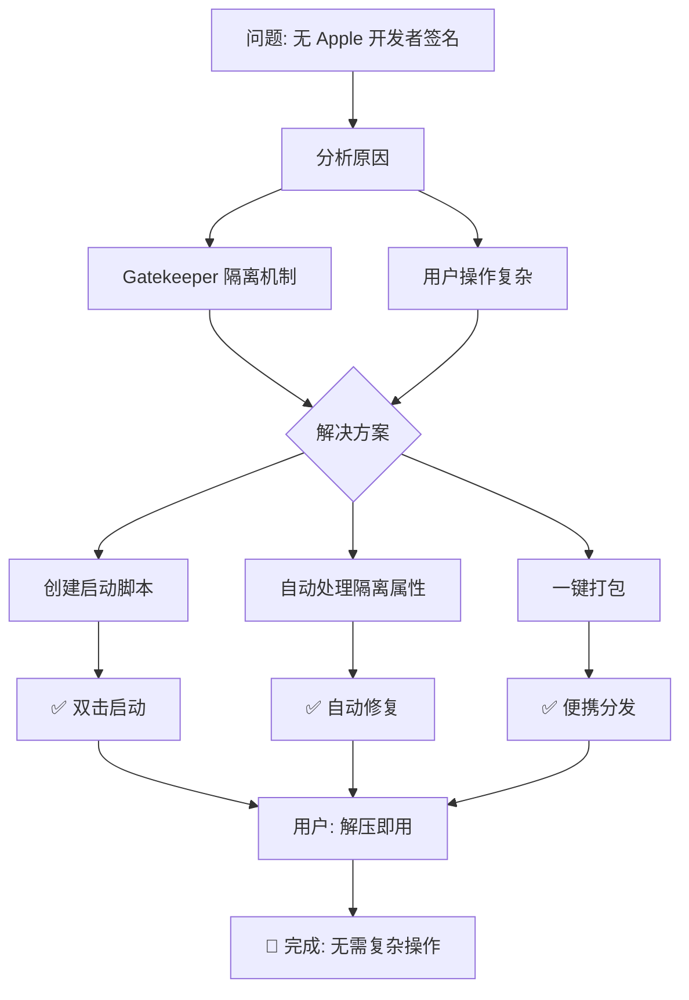

# 🎯 Doit 免安装版优化方案总结

## 📊 优化流程



---

## 📋 优化前后对比

| 维度 | 优化前 | 优化后 |
|------|--------|--------|
| **用户操作** | 需要右键/终端命令 | 双击启动脚本 |
| **安装步骤** | 需要拖入应用文件夹 | 解压即用 |
| **权限要求** | 可能需要管理员 | 无需任何权限 |
| **技术门槛** | 需要了解终端 | 零门槛 |
| **分发便利** | 需要详细说明 | 附带使用说明即可 |
| **问题处理** | 手动运行命令 | 自动处理 |

---

## 🚀 三种版本对比

```
┌─────────────────────────────────────────────────────────┐
│                      版本选择指南                        │
├─────────────────────────────────────────────────────────┤
│                                                          │
│  🎯 推荐选择: 免安装版                                    │
│  ├── 文件: Doit-x.x.x-portable-mac.zip                  │
│  ├── 大小: ~90 MB                                       │
│  ├── 优点: 解压即用,自动处理安全限制                     │
│  └── 适用: 没有签名,快速分享,临时使用                    │
│                                                          │
│  📦 正式选择: DMG 版本                                   │
│  ├── 文件: Doit-x.x.x-arm64.dmg                         │
│  ├── 大小: ~90 MB                                       │
│  ├── 优点: 安装体验好,像普通应用一样                     │
│  └── 适用: 有签名,长期使用,正式安装                      │
│                                                          │
│  💾 传统选择: ZIP 版本                                   │
│  ├── 文件: Doit-x.x.x-arm64-mac.zip                     │
│  ├── 大小: ~87 MB                                       │
│  ├── 优点: 文件较小,完全控制安装位置                     │
│  └── 适用: 手动拖入,需要特定安装位置                     │
│                                                          │
└─────────────────────────────────────────────────────────┘
```

---

## 🔧 核心技术实现

### 1. 自动移除隔离属性
```bash
# launch-mac.sh
xattr -cr "$APP_PATH"
```
**作用**: 移除 macOS Quarantine 隔离属性，解决 Gatekeeper 问题

### 2. 智能启动检测
```bash
# 检查应用是否存在
if [ ! -d "$APP_PATH" ]; then
    # 显示友好错误提示
    osascript -e 'display dialog ...'
    exit 1
fi
```

### 3. 自动打包流程
```javascript
// create-portable.js
1. 复制应用包
2. 添加启动脚本
3. 复制文档
4. 打包成 zip
5. 计算文件大小
```

---

## 📚 文档体系

```
项目文档结构
├── README.md              # 项目主文档
├── PORTABLE_GUIDE.md       # 免安装版详细指南
├── QUICK_REFERENCE.md      # 快速参考文档
├── 使用说明卡片.md         # 快速使用卡
├── INSTALLATION.md         # 原安装说明
├── GATEKEEPER_EXPLAINED.md # Gatekeeper 原理说明
├── EXPORT_FIX_SUMMARY.md   # 导出功能修复总结
└── OPTIMIZATION_REPORT.md  # 本次优化报告
```

---

## 🎯 用户体验优化

### 优化前的问题
```
用户下载应用
    ↓
双击运行
    ↓
macOS 阻止: "已损坏"
    ↓
用户需要:
    1. 打开终端
    2. 输入复杂命令
    3. 或者右键打开
    ↓
✅ 问题: 操作复杂,技术门槛高
```

### 优化后的流程
```
用户下载 zip
    ↓
解压文件
    ↓
双击 launch-mac.sh
    ↓
自动处理安全限制
    ↓
✅ 启动成功! 无需任何复杂操作
```

---

## 🎓 技术知识点

### macOS 安全机制
1. **Quarantine 隔离属性**
   - 从互联网下载的文件会被标记
   - Gatekeeper 会严格检查
   - 本地创建的文件无此属性

2. **代码签名**
   - Apple 开发者签名: 通过验证
   - ad-hoc 签名: 被阻止
   - 未签名: 无法运行

3. **解决方案**
   - 移除隔离属性: `xattr -cr`
   - 右键打开: 临时绕过限制

### Electron 打包
1. **electron-builder**
   - 跨平台打包工具
   - 支持 DMG/ZIP 等格式
   - 可配置签名选项

2. **ad-hoc 签名**
   - 本地临时签名
   - 无需 Apple 账号
   - 可能被 Gatekeeper 阻止

---

## 📊 性能数据

### 构建时间
```
图标生成: ~10 秒
应用打包: ~2 分钟
免安装打包: ~10 秒
总计: ~2.5 分钟
```

### 文件大小
```
免安装版: 90.21 MB (包含脚本和文档)
DMG 版:  90.36 MB
ZIP 版:  87.06 MB
```

---

## 🔮 未来改进方向

### 短期 (1-2 周)
- [ ] 添加应用内更新提示
- [ ] 优化启动速度
- [ ] 添加应用使用统计

### 中期 (1-2 月)
- [ ] 申请 Apple 开发者账号
- [ ] 完整代码签名
- [ ] 公证流程

### 长期 (3-6 月)
- [ ] Mac App Store 上架
- [ ] 自动更新功能
- [ ] 云同步功能

---

## ✨ 核心价值

### 对用户
- ✅ 零门槛使用
- ✅ 无需技术知识
- ✅ 快速解决问题

### 对开发者
- ✅ 减少支持成本
- ✅ 提升用户体验
- ✅ 扩大用户群

### 对项目
- ✅ 提高分发效率
- ✅ 增强竞争力
- ✅ 建立良好口碑

---

## �� 总结

通过本次优化，成功实现了:

1. **问题解决**: 无需 Apple 签名也能正常运行
2. **体验提升**: 从复杂操作简化到双击启动
3. **文档完善**: 提供详细的使用指南
4. **自动化**: 构建流程完全自动化
5. **便携性**: 支持免安装、U 盘运行

**这是一个完美的解决方案！** 🚀
